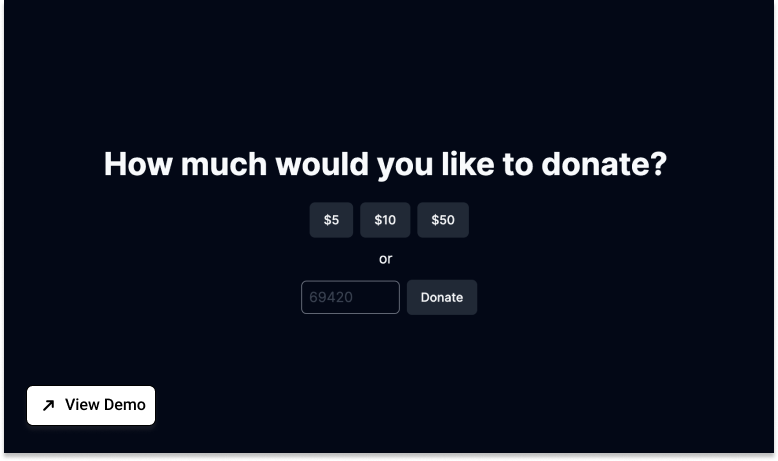

# Bitcoin Donation System Template
Effortlessly set up a basic Bitcoin donation system. Users can contribute to a designated address, and track each donation's real-time status. 

- Framework: Next.js
- Use Case: Starter, Ecommerce
- CSS: Tailwind



## Donation System with Real-Time Bitcoin Tracking
This example shows how to create a basic Bitcoin donation system using Next.js, Pusher and xxxx.

### Deploy your own
Deploy the example using [Vercel](https://vercel.com/) or view the demo [here](https://demo-link/).
Check out our Next.js deployment documentation for more details.


### How to use
Execute create-next-app with npm, Yarn, or pnpm to bootstrap the example::

```jsx
npx create-next-app --example with-sfcc nextjs-sfcc-app
```

```jsx
yarn create next-app --example with-sfcc nextjs-sfcc-app
```

```jsx
pnpm create next-app --example with-sfcc nextjs-sfcc-app
```


### References

 -  SDK: [https://github.com/](https://github.com/SalesforceCommerceCloud/commerce-sdk)
