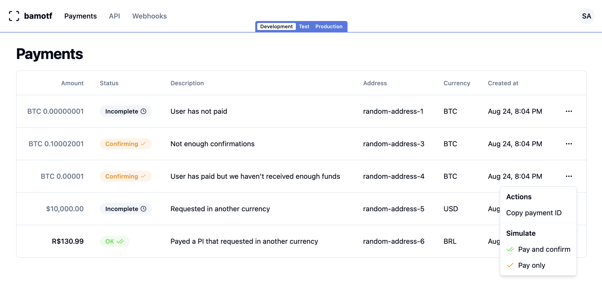

import {Steps} from 'nextra/components'

# Testing integration during development

Testing your integration with the Bitcoin Network can be tricky. You need to
wait for confirmations and have some coins to test with. But don't worry!
**bamotf** has a `development` mode that makes this process simpler. This guide
will show you how to enable and how to use it.

## Running the development mode

To use the development mode, you need to do a few things:

<Steps>
### Enable dev mode
Run the bamotf server with the `DEV_MODE_ENABLED` environment variable turned
on. You can do this by adding `DEV_MODE_ENABLED=true` to your docker-compose
file.

### Set up credentials and webhook

Set the `DEV_API_KEY`, `DEV_WEBHOOK_URL`, and `DEV_WEBHOOK_SECRET` environment
variables. These are needed to access the bamotf server locally and to set up
the webhook that gets called when the dev payment is done.

</Steps>
Here is an example of a docker-compose file that enables the development mode:

```yml filename="docker-compose.yml" copy
version: '3.8'
services:
  bamotf:
    ...
    environment:
      ...
      - DEV_MODE_ENABLED=true
      - DEV_API_KEY=no-key
      - DEV_WEBHOOK_URL=http://localhost:3000/my-webhook-page  # replace with your webhook url
      - DEV_WEBHOOK_SECRET=no-secret

  postgres:
    ...
```

## Testing your integration

Once you've [set up your payment intent](./creating-payment-intents.mdx), it's
time to test your integration. Here's a step-by-step guide:

<Steps>

### Open the bamotf dashboard

Open your web browser and navigate to
[`http://localhost:21000/payments`](http://localhost:21000/payments). This page
displays all payment intents received by your server.

Make sure you've selected `development` mode. You'll find this option at the
bottom of the main navigation bar.

Your page should now look like this:



### Simulate a payment

To simulate a payment and automatically confirm it, click on the `Ellipse`
button next to the payment intent. Then, select the `Pay and confirm` option.
This action simulates a successful payment.

If you want to simulate a payment without confirming it, click on `Pay only`.
Use this option to test how your integration handles unconfirmed payments.

</Steps>

After you've simulated a payment, you should have received a webhook request to
the URL you specified in the `DEV_WEBHOOK_URL` environment variable. You can
check the logs of your server to see if the webhook was received.
