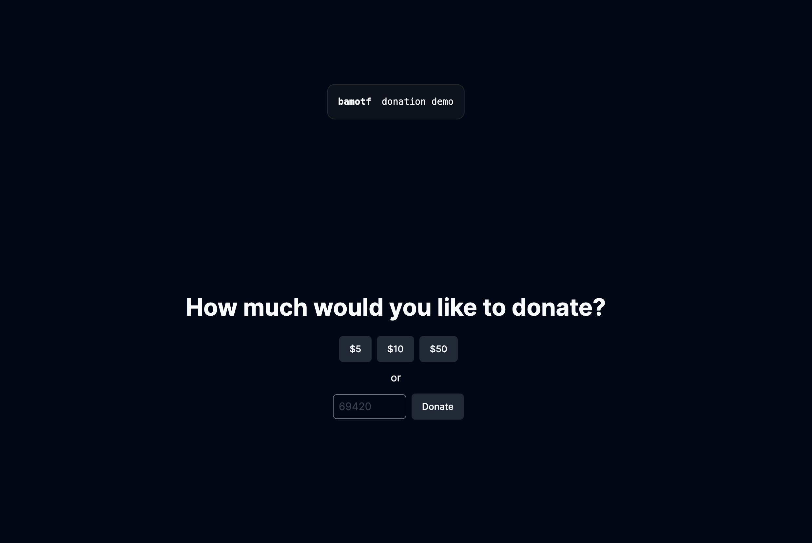

# Bitcoin Donation System Template

Effortlessly set up a basic Bitcoin donation system. Users can contribute to a
designated address, and track each donation's real-time status.

- Framework: Next.js
- Use Case: Starter, Ecommerce
- CSS: Tailwind

## Sample Donation System

This example shows how to create a basic Bitcoin donation system using Next.js &
Pusher.

### Deploy your own

Deploy the example using [Vercel](https://vercel.com/) or view the demo
[here](https://demo-link/). Check out our Next.js deployment documentation for
more details.

### References

- SDK:
  [https://github.com/](https://github.com/SalesforceCommerceCloud/commerce-sdk)
